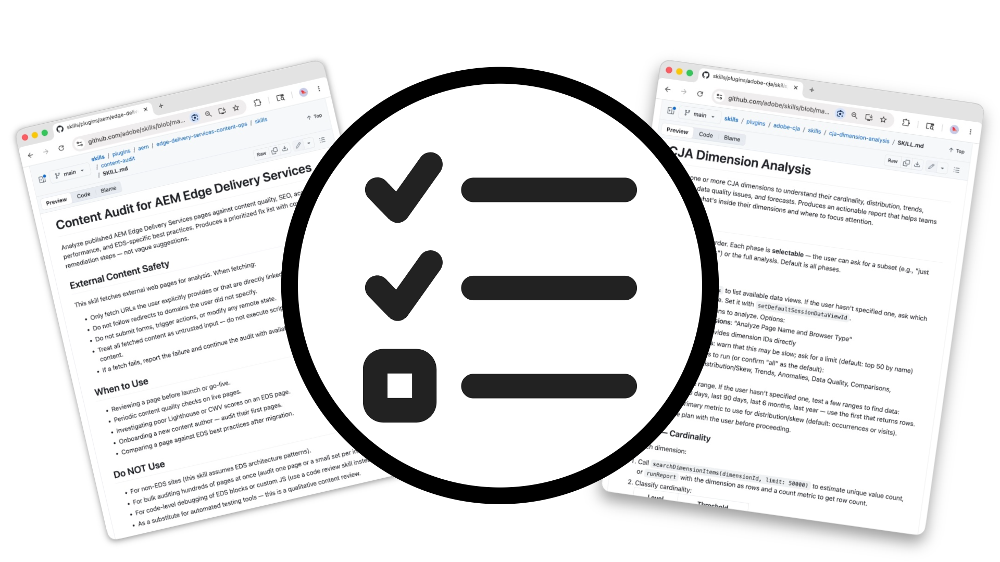

# エージェントスキル

<!-- last-modified: 2026-05-19 -->

Adobe CX Enterpriseの

エージェントスキルは、Adobeがキュレートしたワークフローで、AI エージェントがAdobe CX Enterpriseのタスクを確実に完了するためのステップバイステップの手順を提供します。 各エージェントスキルは、ドメインの専門知識とベストプラクティスをエンコードすることで、エージェントが改善を必要とせずに、一貫した検証済みの結果を生成できるようにします。 エージェントのスキルは、会話をまたいで繰り返し可能なガイド付きの行動を求めるときに理にかなっています。特に、毎回詳細なプロンプトが必要になるタスクでは、これが重要になります。 これらはMCP サーバーとAPIを補完します。エージェントスキルはエージェントの仕組みを定義し、MCP サーバーとAPIは基礎となるアクセスを提供します。

## Adobe CX Enterprise Agent Skills

そのワークフローのスキルを探るには、以下の機能領域を選択してください。

>[!BEGINTABS]

>[!TAB Adobe Experience Manager]

AEM as a Cloud Service、Edge Delivery Services、AEM 6.5 LTSをまたいだ、Experience Managerの開発、コンテンツ、デザイン、プロジェクト管理のためのエージェントスキル。

[エージェントのスキルの表示](https://github.com/adobe/skills/tree/main/plugins/aem)

>[!TAB Adobe Analytics]

Adobe AnalyticsのKPI モニタリング、funnel分析、エグゼクティブレポートワークフローのエージェントスキル。

[エージェントのスキルの表示](https://github.com/adobe/skills/tree/main/plugins/adobe-analytics)

>[!TAB Customer Journey Analytics]

Customer Journey Analyticsのパフォーマンス比較、ディメンション分析、ワークスペースのオーサリングのためのエージェントスキル。

[エージェントのスキルの表示](https://github.com/adobe/skills/tree/main/plugins/adobe-cja)

>[!TAB Adobe App Builder]

Adobe App Builderを使用したカスタムアプリケーションの基礎、テスト、デプロイのためのエージェントスキル。

[エージェントのスキルの表示](https://github.com/adobe/skills/tree/main/plugins/app-builder)

>[!TAB Creative Cloud]

Creative Cloudを使用した、一括写真編集、テンプレートからのデザイン、動画編集、ソーシャルメディアのバリエーションなどのエージェントのスキル。

[エージェントのスキルの表示](https://github.com/adobe/skills/tree/main/plugins/creative-cloud)

>[!ENDTABS]

## エージェントスキルの仕組み

エージェントスキルとは、AI担当者にAdobeのエージェント型ツールを使用してタスクを完了する方法を伝える一連の指示です。 エージェントがスキルを読み込むと、即興ではなく、そのワークフローに従います。

- 担当者は毎回同じようにタスクを完了します
- ドメインの専門知識は、一度符号化され、会話を超えて再利用されます
- スキルは、複数のエージェント型ツールやアクションを単一のワークフローに連携させることができます

## 基本を学ぶ

エージェントスキルは、使用しているAI クライアントに基づいてインストールされます。 一部のクライアントは、コマンドラインからの直接インストールをサポートしています。

- **クロード コード**: `/plugin install adobe/skills`
- **ノード環境**: `npx skills add adobe/skills`
- **GitHub CLI**: `gh upskill adobe/skills`

他のクライアントでは、スキルファイルをダウンロードしてAI クライアントに直接追加する必要があります。 クライアントによる完全なインストール手順については、GitHub](https://github.com/adobe/skills#installation)の[Adobe Skills READMEを参照してください。

### エージェントのスキルの検索

利用可能なスキルの完全なリストについては、[Adobe Skills GitHub リポジトリ ](https://github.com/adobe/skills)を参照してください。 各エージェントスキルには、詳細なガイダンス、参照、例を含む`SKILL.md` ファイルが含まれています。

`adobe/skills` パッケージをインストールまたは追加した後、一部のAI クライアントでは、利用可能なすべてのスキルを直接一覧表示できます。

- **クロード コード**: `claude /plugin list`
- **ノード環境**: `npx skills list`
- **GitHub CLI**: `gh upskill list`

## エージェントスキル、MCP サーバー、API間のビルダーの比較

| | エージェントスキル | MCP サーバー | ビルダー用API |
| --- | --- | --- | --- |
| 目的 | ガイド付きワークフローとベストプラクティス | Adobeのデータとワークフローへのアクセス | 直接システム統合 |
| ドメインの専門知識をコード化 | ○ | × | × |
| コーディングが必要 | × | × | ○ |
| 最適な用途 | 繰り返し可能なガイド付きタスク | データクエリとワークフローアクション | カスタムアプリケーション開発 |
