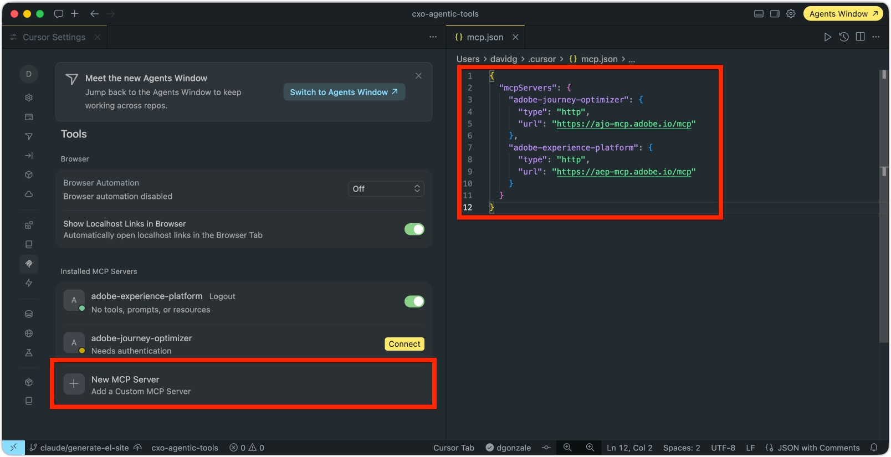

# MCP サーバー

<!-- last-modified: 2026-09-16 -->

Adobe MCP サーバーは、互換性のあるあらゆるAI クライアントに、Adobeデータとワークフローへの直接的で管理されたアクセスを提供します。 接続すれば、AI環境から直接、キャンペーンのパフォーマンスのクエリ、オーディエンスのアクティベーション、ジャーニーのレビュー、コンテンツの管理などをおわかりやすい言葉で行うことができます。 MCP サーバーは、AI クライアントとAdobeの基盤システムの間に配置されているため、企業のアクセス制御とデータガバナンスを維持しながら、自然言語の柔軟性を実現できます。

Adobe MCP サーバーは、オープン [ モデル コンテキスト プロトコル ](https://modelcontextprotocol.io/docs/getting-started/intro)標準に従います。 MCP対応のAI クライアントは、あらゆるAdobe MCP サーバーに接続できます。

## CX Enterprise MCP サーバー {#cx-enterprise-mcp-servers}

>[!CONTEXTUALHELP]
>id="cx-enterprise-agentic-tools_mcp_servers_cx-enterprise"
>title="CX Enterprise Coworker"
>abstract="サーバーの設定を行わずに、さまざまな CX Enterprise アプリケーションをまたいで平易な言語でアクションを実施できます。 独自の MCP サーバーを持つ個々のアプリケーションの場合は、代わりに直接接続します。"
>additional-url="https://experienceleague.adobe.com/ja/docs/cx-enterprise-coworker/content/home" text="CX Enterprise Coworker ドキュメント"


**CX Enterprise アプリケーション全体で最も迅速に作業できる方法は、CX Enterprise Coworkerです。** サーバーの設定、登録するエンドポイント、AI クライアントの設定なしで、CX エンタープライズアプリケーションに接続します。 [CX Enterprise Coworkerを試す](https://experienceleague.adobe.com/ja/docs/cx-enterprise-coworker/content/home)

独自のAI クライアントを特定のAdobeアプリケーションに直接接続する場合は、いくつかのアプリケーションにも独自のMCP サーバーがあります。

| MCP サーバー | エンドポイント | 実行できること | CX Enterprise Coworker経由でも |
| --- | --- | --- | --- |
| [Adobe Journey Optimizer](https://experienceleague.adobe.com/en/docs/experience-cloud-ai/experience-cloud-ai/mcp/mcp-product-tools/ajo-mcp) | `https://ajo-mcp.adobe.io/mcp` | ジャーニー、キャンペーン、チャネル設定の確認 | ○ |
| [Customer Journey Analytics](https://experienceleague.adobe.com/en/docs/experience-cloud-ai/experience-cloud-ai/mcp/mcp-product-tools/cja-mcp) | `https://cja-mcp.adobe.io/mcp` | レポートのクエリ、データビューの確認、ワークスペースの作成 | ○ |
| [Adobe Analytics](https://experienceleague.adobe.com/en/docs/experience-cloud-ai/experience-cloud-ai/mcp/mcp-product-tools/analytics-mcp) | `https://aa-mcp.adobe.io/mcp` | レポートスイートの検出、セグメントのオーサリング、ワークスペースの作成 | ○ |
| [Adobe Target](https://experienceleague.adobe.com/en/docs/target/using/mcp/target-mcp) | `https://targetmcp.adobe.io/mcp` | アクティビティ、オファー、オーディエンス、mbox、パフォーマンスレポート、プレビューURLの確認（公開ベータ版：ツールは読み取り専用、書き込みツールは一般公開用に計画されています） | ○ |
| [Real-Time CDP](https://experienceleague.adobe.com/en/docs/experience-platform/rtcdp/intro/rtcdp-mcp) | `https://rtcdp-mcp.adobe.io/mcp` | オーディエンス、宛先、ソース、フロー実行を検索し、ID名前空間と結合ポリシーを調べます（パブリックベータ版：必須、すべてのツールは読み取り専用） | ○ |
| [AEM MCP Server](https://experienceleague.adobe.com/ja/docs/experience-manager-learn/cloud-service/ai/mcp-servers/overview) | `https://mcp.adobeaemcloud.com/adobe/mcp/aem` | ページ、コンテンツフラグメント、アセット、ローンチを管理し、ブランドガイドラインやコンプライアンスルールに照らし合わせてコンテンツや画像を評価できます | ○ |
| [AEM Cloud Manager](https://experienceleague.adobe.com/ja/docs/experience-manager-learn/cloud-service/ai/mcp-servers/cloud-manager) | `https://mcp.adobeaemcloud.com/adobe/mcp/cloudmanager` | プログラム、環境、パイプライン、リポジトリの管理 | × |
| Adobe Marketing Agent | `https://aep-ai-ama.adobe.io/mcp` | AEPアプリケーションをまたいで、オーディエンス分析、AEP診断、AJO B2B ジャーニーの構築を連携できます | × |
| [Adobe Workfront](https://experienceleague.adobe.com/en/docs/workfront/using/basics/workfront-mcp-server/workfront-mcp-server-overview) | `https://mcp.prod.us-west-2.aws.wfk8s.com/mcp/v1/workfront` | 作業、プロジェクト、プランニングレコード、インサイト、コンテンツ承認を管理できます | × |
| [Marketo Engage](https://experienceleague.adobe.com/en/docs/marketo-developer/marketo/mcp-server) | `https://marketo-mcp.adobe.io/mcp` | フォーム、スマートキャンペーン、リード、リスト、プログラム、メール、一括処理を管理します | ○ |
| Adobe Experience Platform | [CX Enterprise Coworker](https://experienceleague.adobe.com/ja/docs/cx-enterprise-coworker/content/home)経由 | データセットの発見、スキーマの閲覧、サンドボックスの管理 | なし |
| Campaign Classic | [CX Enterprise Coworker](https://experienceleague.adobe.com/ja/docs/cx-enterprise-coworker/content/home)経由 | キャンペーンインスタンスの検出、スキーマの参照、クエリの実行、ワークフロー制御、SOAP/JSの実行 | なし |
| 実験 | [CX Enterprise Coworker](https://experienceleague.adobe.com/ja/docs/cx-enterprise-coworker/content/home)経由 | A/B、MVT、MABの実験レポート、指標、インサイト、機会、サンプルサイズ計画 | なし |
| パフォーマンスマーケティング用の GenStudio | [CX Enterprise Coworker](https://experienceleague.adobe.com/ja/docs/cx-enterprise-coworker/content/home)経由 | 広告パフォーマンスデータとクリエイティブインサイトへのアクセス | なし |
| Adobe Journey Optimizer B2B edition | [CX Enterprise Coworker](https://experienceleague.adobe.com/ja/docs/cx-enterprise-coworker/content/home)経由 | B2B ジャーニー、アカウントプログラム、購買グループ、パーソナライゼーションの管理 | なし |

>[!NOTE]
>
>各MCP サーバーへのアクセスは、そのアプリケーションに対する組織の使用権限と、そのアプリケーション内でのユーザーの権限によって異なります。 残りの5行には、直接接続に使用できる独自のMCP サーバーがありません。 今すぐCX Enterprise Coworkerでアプローチしましょう。

## AI クライアントに接続します

ほとんどのAdobe MCP サーバーは、Adobe Identity Management サービス（IMS）でOAuthを使用します。 プロンプトが表示されたら、正しいIMS組織を選択します。 間違ったものを選択することは、認証エラーの最も一般的な原因です。


CX Enterprise Coworkerを使用すると、これらの連携は自動的に行われます。 以下の項目は適用されません。 以下の手順は、独自のAI クライアントをAdobe MCP Serverに直接接続し、AEM MCP Server エンドポイントを例として使用する場合です。 同じプロセスがAdobe MCP サーバーにも適用されます。接続するサーバーのエンドポイント URLをスワップします。

>[!BEGINTABS]

>[!TAB CX Enterprise Coworker]

CX Enterprise Coworkerには、これらのMCP機能の多くが既に搭載されています。 追加するサーバーも、登録するエンドポイントも、設定するAI クライアントもありません。 CX Enterprise Coworkerにログインすると、すぐに使用できます。

完全なドキュメント：[CX Enterprise Coworker ドキュメント ](https://experienceleague.adobe.com/ja/docs/cx-enterprise-coworker/content/home)

>[!TAB  クロード.ai]

###  マネージド コネクタを使用

[Adobe AI レジストリ ](https://developer.adobe.com/ai-registry/?type=connector)に移動し、Adobe アプリケーションを検索します。 Claude コネクタが一覧表示されている場合（例：[Adobe Experience Manager コネクタ ](https://developer.adobe.com/ai-registry/#/connectors/adobe-experience-manager-connector)）、次の手順ではなく、その設定手順に従います。

### カスタムコネクタを使用した接続

Claude.aiは、アカウント設定のカスタムコネクタを介してリモート MCP サーバーをサポートします。

1. **設定/統合**&#x200B;に移動します。
2. 「**カスタムコネクタを追加**」をクリックします。
3. サーバーエンドポイントをURL （AEM MCP Serverの場合は`https://mcp.adobeaemcloud.com/adobe/mcp/aem`など）として入力し、任意の表示名を入力します。
4. **Connect**&#x200B;をクリックし、Adobe IDでログインします。 適切なIMS組織を選択します。

完全なセットアップ：[Claude.ai カスタムコネクタのドキュメント ](https://support.claude.com/en/articles/11175166-get-started-with-custom-connectors-using-remote-mcp)

>[!TAB  クロード コード ]

### CLIの使用

`claude mcp add`を実行して、Adobe MCP サーバーを登録します。 サーバー名とURLを、接続するサーバーの値に置き換えます。 この例では、AEM MCP Serverを使用します。

```bash
claude mcp add --transport http adobe-aem https://mcp.adobeaemcloud.com/adobe/mcp/aem
```

### 設定ファイルを編集

サーバーをプロジェクトルート （プロジェクトレベル）の`~/.claude.json` （グローバル）または`.mcp.json`に追加します。 キーとURLを、接続するサーバーの値に置き換えます。

```json
{
  "mcpServers": {
    "adobe-aem": {
      "type": "http",
      "url": "https://mcp.adobeaemcloud.com/adobe/mcp/aem"
    }
  }
}
```

Adobe MCP サーバーはOAuthを使用します。 Claude Codeは、ツールを初めて呼び出したときに、Adobe IDでの認証を求めるプロンプトを表示します。 プロンプトが表示されたら、正しいIMS組織を選択します。

完全なセットアップ：[Claude Code MCP ドキュメント ](https://docs.anthropic.com/en/docs/claude-code/mcp)

>[!TAB  カーソル ]

Adobe MCP サーバーをCursor `mcp.json`設定ファイルに追加し、**Settings > MCP**&#x200B;経由で接続します。 キーとURLを、接続するサーバーの値に置き換えます。 この例では、AEM MCP Serverを使用します。

- **グローバル （すべてのプロジェクト）:** `~/.cursor/mcp.json`
- **プロジェクトレベル：** `.cursor/mcp.json` （プロジェクトルート内）

```json
{
  "mcpServers": {
    "adobe-aem": {
      "type": "http",
      "url": "https://mcp.adobeaemcloud.com/adobe/mcp/aem"
    }
  }
}
```

追加すると、カーソル設定の&#x200B;**インストール済みMCP サーバー**&#x200B;の下にMCP サーバーが表示されます。 **認証が必要**&#x200B;と表示されているサーバーの横にある&#x200B;**Connect**&#x200B;を選択し、Adobe IDでログインします。 アプリケーションにアクセスできるIMS組織を選択します。

を示すCursor MCP サーバー設定

完全なセットアップ：[ カーソル MCP ドキュメント ](https://cursor.com/docs/mcp)

>[!TAB ChatGPT]

###  マネージド コネクタを使用

[Adobe AI レジストリ ](https://developer.adobe.com/ai-registry/?type=connector)に移動し、Adobe アプリケーションを検索します。 ChatGPT コネクタがリストされている場合は、以下の手順ではなく、その設定手順に従います。

### リモート MCP サーバーを使用した接続

ChatGPT管理者に、組織のMCP サーバーを追加するように依頼します。 これにより、すべてのユーザーは以下の設定なしで接続できます。

管理者が追加できない場合、またはアカウントの接続のみを希望する場合は、次の手順に従います。

**1回限りのセットアップ：**&#x200B;は、カスタム MCP URLを登録する前に開発者モードをオンにします。

1. **設定/ セキュリティとログイン**&#x200B;に移動します。
2. **開発者モード**&#x200B;を有効にします。

**サーバーを追加：**

1. **設定/ プラグイン / プラグインを参照**&#x200B;に移動します。
2. **+**&#x200B;を選択して、新しいプラグインを追加します。
3. 名前（例：`AEM Content AI`または`Adobe Journey Optimizer`）を入力します。
4. 説明を入力します。
5. **サーバーURL**&#x200B;を選択します。
6. **Connection**&#x200B;で、Adobeの完全なMCP URLを入力します。 例えば、AEMの場合は`https://mcp.adobeaemcloud.com/adobe/mcp/aem`、Adobe Journey Optimizerの場合は`https://ajo-mcp.adobe.io/mcp`です。
7. **認証**&#x200B;を&#x200B;**OAuth**&#x200B;に設定します。
8. 利用規約を読んで同意する：
9. 「**作成**」を選択します。
10. MCP サーバーが接続するCX Enterprise アプリケーションにアクセスできるAdobe アカウントでログインします。

完全なセットアップ：[ChatGPT MCP ドキュメント ](https://developers.openai.com/api/docs/guides/tools-connectors-mcp)

>[!TAB OpenAI Codex CLI]

OpenAI Codex CLIは、TOML設定を介してリモート MCP サーバーをサポートします。

**ファイルの場所を設定：**

- **ユーザーレベル （すべてのプロジェクト）:** `~/.codex/config.toml`
- **プロジェクト範囲：** `.codex/config.toml` （プロジェクトルート内）

セクション名とURLを、接続するサーバーの値に置き換えます。 この例では、AEM MCP Serverを使用します。

```toml
[mcp_servers.adobe-aem]
url = "https://mcp.adobeaemcloud.com/adobe/mcp/aem"
enabled = true
```

Adobe MCP サーバーはOAuthを使用します。 Codex CLIは、初回使用時にOAuth フローを自動的に処理します。 プロンプトが表示されたら、正しいIMS組織を選択します。

完全なセットアップ：[OpenAI Codex CLI MCP ドキュメント ](https://developers.openai.com/codex/mcp)

>[!TAB  コパイロット スタジオ ]

Microsoft Copilot Studioは、Power Platform カスタムコネクタを自動的に作成するMCP オンボーディングウィザードを使用して、リモート MCP サーバーに接続します。

1. Copilot Studioでエージェントを開きます。
2. **ツール** ページに移動します。
3. **ツールを追加/新規ツール/モデルコンテキストプロトコル**&#x200B;を選択します。
4. MCP オンボーディングウィザードで、サーバーの詳細を入力します。 例えば、AEM MCP Serverの場合は次のようになります。
   - **サーバー名：** `AEM`
   - **サーバーURL:** `https://mcp.adobeaemcloud.com/adobe/mcp/aem`
5. Authenticationを&#x200B;**OAuth 2.0**&#x200B;に設定し、Adobe IMS認証とトークン URLを使用して設定します。
6. 「**作成**」、「**エージェントに追加**」の順に選択します。

>[!NOTE]
>
>Copilot StudioのMCP サーバー接続は、Power Platformを介して行われます。 組織のデータ損失防止（DLP）ポリシーが適用されます。

完全なセットアップ：[Copilot Studio MCP ドキュメント ](https://learn.microsoft.com/microsoft-copilot-studio/mcp-add-existing-server-to-agent)

>[!ENDTABS]

## MCP サーバーの実際

実際のビジネス上の問題に対してAdobe MCP サーバーが機能することを確認します。 各チュートリアルは、真の運用上の課題から始まり、AI クライアントがツールを切り替えたりコードを記述したりすることなく、それをどのように平易な言語で解決するかを示しています。

<!--
CARDS

* ../use-cases/analyze-campaign-performance.md
  {title = Campaign insights without reports}
  {description = Ask performance questions in plain language and get answers from Customer Journey Analytics, without building a single report.}
  {cta = Surface campaign insights}

* ../use-cases/query-audiences.md
  {title = Audience activation at a glance}
  {description = See which audiences are live, where they are flowing, and whether destinations are healthy, without navigating Real-Time CDP.}
  {cta = Check audience activation}

* ../use-cases/manage-ajo-journeys.md
  {title = Catch journey issues early}
  {description = Monitor active journeys and surface operational issues before they reach your audience.}
  {cta = Monitor your journeys}

* ../use-cases/manage-aem-content.md
  {title = Ship content updates faster}
  {description = Find, update, and publish AEM pages and content fragments faster, without switching to the AEM interface.}
  {cta = Ship content faster}

* ../use-cases/optimize-content-with-performance-data.md
  {title = Close content performance gaps}
  {description = Surface conversion gaps in CJA, trace them to underperforming content in AEM, and apply the fix in a single AI session.}
  {cta = Close performance gaps}
-->

<!-- START CARDS HTML - DO NOT MODIFY BY HAND -->
<div class="columns">
    <div class="column is-half-tablet is-half-desktop is-one-third-widescreen" aria-label="Campaign insights without reports">
        <div class="card" style="height: 100%; display: flex; flex-direction: column; height: 100%;">
            <div class="card-image">
                <figure class="image x-is-16by9">
                    <a href="../use-cases/analyze-campaign-performance.md" title="レポートを使用しないキャンペーンインサイト">
                        
                    </a>
                </figure>
            </div>
            <div class="card-content is-padded-small" style="display: flex; flex-direction: column; flex-grow: 1; justify-content: space-between;">
                <div class="top-card-content">
                    <p class="headline is-size-6 has-text-weight-bold">
                        レポートのない<a href="../use-cases/analyze-campaign-performance.md" title="レポートを使用しないキャンペーンインサイト"> キャンペーンインサイト </a>
                    </p>
                    <p class="is-size-6">単一のレポートを作成することなく、平易な言語でパフォーマンスに関する質問をおこない、Customer Journey Analyticsから回答を得ることができます。</p>
                </div>
                <a href="../use-cases/analyze-campaign-performance.md" class="spectrum-Button spectrum-Button--outline spectrum-Button--primary spectrum-Button--sizeM" style="align-self: flex-start; margin-top: 1rem;">
                    <span class="spectrum-Button-label has-no-wrap has-text-weight-bold"> キャンペーンのインサイトを表示</span>
                </a>
            </div>
        </div>
    </div>
    <div class="column is-half-tablet is-half-desktop is-one-third-widescreen" aria-label="Audience activation at a glance">
        <div class="card" style="height: 100%; display: flex; flex-direction: column; height: 100%;">
            <div class="card-image">
                <figure class="image x-is-16by9">
                    <a href="../use-cases/query-audiences.md" title="オーディエンスのアクティベーション概要">
                        
                    </a>
                </figure>
            </div>
            <div class="card-content is-padded-small" style="display: flex; flex-direction: column; flex-grow: 1; justify-content: space-between;">
                <div class="top-card-content">
                    <p class="headline is-size-6 has-text-weight-bold">
                        <a href="../use-cases/query-audiences.md" title="オーディエンスのアクティベーション概要"> オーディエンスのアクティベーション概要</a>
                    </p>
                    <p class="is-size-6">Real-Time CDPを使わずに、どのオーディエンスがライブなのか、どこを流れているのか、宛先が健全なのかを確認できます。</p>
                </div>
                <a href="../use-cases/query-audiences.md" class="spectrum-Button spectrum-Button--outline spectrum-Button--primary spectrum-Button--sizeM" style="align-self: flex-start; margin-top: 1rem;">
                    <span class="spectrum-Button-label has-no-wrap has-text-weight-bold"> オーディエンスのアクティブ化を確認</span>
                </a>
            </div>
        </div>
    </div>
    <div class="column is-half-tablet is-half-desktop is-one-third-widescreen" aria-label="Catch journey issues early">
        <div class="card" style="height: 100%; display: flex; flex-direction: column; height: 100%;">
            <div class="card-image">
                <figure class="image x-is-16by9">
                    <a href="../use-cases/manage-ajo-journeys.md" title="ジャーニーの課題を早期に把握">
                        
                    </a>
                </figure>
            </div>
            <div class="card-content is-padded-small" style="display: flex; flex-direction: column; flex-grow: 1; justify-content: space-between;">
                <div class="top-card-content">
                    <p class="headline is-size-6 has-text-weight-bold">
                        <a href="../use-cases/manage-ajo-journeys.md" title="ジャーニーの課題を早期に把握"> ジャーニーの問題を早期に検出</a>
                    </p>
                    <p class="is-size-6">アクティブなジャーニーを監視し、オーディエンスにリーチする前に運用上の問題を特定します。</p>
                </div>
                <a href="../use-cases/manage-ajo-journeys.md" class="spectrum-Button spectrum-Button--outline spectrum-Button--primary spectrum-Button--sizeM" style="align-self: flex-start; margin-top: 1rem;">
                    <span class="spectrum-Button-label has-no-wrap has-text-weight-bold"> ジャーニーの監視</span>
                </a>
            </div>
        </div>
    </div>
    <div class="column is-half-tablet is-half-desktop is-one-third-widescreen" aria-label="Ship content updates faster">
        <div class="card" style="height: 100%; display: flex; flex-direction: column; height: 100%;">
            <div class="card-image">
                <figure class="image x-is-16by9">
                    <a href="../use-cases/manage-aem-content.md" title="コンテンツの更新をより迅速に配信">
                        
                    </a>
                </figure>
            </div>
            <div class="card-content is-padded-small" style="display: flex; flex-direction: column; flex-grow: 1; justify-content: space-between;">
                <div class="top-card-content">
                    <p class="headline is-size-6 has-text-weight-bold">
                        <a href="../use-cases/manage-aem-content.md" title="コンテンツの更新をより迅速に配信"> コンテンツの更新をより迅速に配信</a>
                    </p>
                    <p class="is-size-6">AEMのインターフェイスに切り替えることなく、AEMのページとコンテンツフラグメントをより迅速に検索、更新、公開できます。</p>
                </div>
                <a href="../use-cases/manage-aem-content.md" class="spectrum-Button spectrum-Button--outline spectrum-Button--primary spectrum-Button--sizeM" style="align-self: flex-start; margin-top: 1rem;">
                    <span class="spectrum-Button-label has-no-wrap has-text-weight-bold"> コンテンツの迅速な配信</span>
                </a>
            </div>
        </div>
    </div>
    <div class="column is-half-tablet is-half-desktop is-one-third-widescreen" aria-label="Close content performance gaps">
        <div class="card" style="height: 100%; display: flex; flex-direction: column; height: 100%;">
            <div class="card-image">
                <figure class="image x-is-16by9">
                    <a href="../use-cases/optimize-content-with-performance-data.md" title="コンテンツのパフォーマンスのギャップを埋める">
                        
                    </a>
                </figure>
            </div>
            <div class="card-content is-padded-small" style="display: flex; flex-direction: column; flex-grow: 1; justify-content: space-between;">
                <div class="top-card-content">
                    <p class="headline is-size-6 has-text-weight-bold">
                        <a href="../use-cases/optimize-content-with-performance-data.md" title="コンテンツのパフォーマンスのギャップを埋める"> コンテンツパフォーマンスのギャップを埋める</a>
                    </p>
                    <p class="is-size-6">CJAでコンバージョンのギャップを明らかにし、AEMでコンバージョンの低いコンテンツをたどり、それを修正するために1回のAI セッションを実施します。</p>
                </div>
                <a href="../use-cases/optimize-content-with-performance-data.md" class="spectrum-Button spectrum-Button--outline spectrum-Button--primary spectrum-Button--sizeM" style="align-self: flex-start; margin-top: 1rem;">
                    <span class="spectrum-Button-label has-no-wrap has-text-weight-bold"> パフォーマンス ギャップを閉じる</span>
                </a>
            </div>
        </div>
    </div>
</div>
<!-- END CARDS HTML - DO NOT MODIFY BY HAND -->

## もっと手伝いが必要ですか？

MCP接続には、認証、組織の選択、アプリケーションレベルの権限が含まれます。 何かが期待どおりに機能しない場合は、これらの手順で最も一般的な原因を説明します。

+++Adobe組織の切り替え

Adobe ユーザーが複数のIMS組織に属しており、間違った組織のツールやデータが表示されている場合は、MCP サーバーを切断し、ブラウザーでAdobe セッションからログアウトしてから、再接続します。 ログイン時に組織を選択するよう求められます。

Adobe MCP サーバーは、ユーザーアカウントが複数のIMS組織にアクセスできる場合でも、一度に1つのIMS組織に対してのみ認証できます。

+++

+++サンドボックス、レポートスイート、環境、またはその他のセッションリソースの指定

一部のAdobe MCP サーバーでは、結果を返す前にリソースを指定する必要があります。 アプリケーションによっては、サンドボックス、プログラム、環境、レポートスイート、データビューなどがあります。

アクセスできるリソースがわからない場合は、AI クライアントに問い合わせます。 例：「使用可能なサンドボックスのリスト」または「どのレポートスイートにアクセスできますか？」 Adobe MCP サーバーは、多くの場合、ユーザーが利用できるリソースの完全なリストを返します。

セッションリソースを設定したら、どのリソースを使用するかをAI クライアントに伝えることで、いつでも切り替えることができます。

+++

+++権限とアクセスのエラー

AI クライアントは、OAuthを使用して、Adobeユーザーアカウントの代理として行動します。 Adobe アプリケーションにログインするときに適用される同じ権限とアクセス制御は、MCP サーバーを使用するときに適用されます。

アクションが失敗するか、結果が返されない場合は、Adobe Admin Consoleおよび関連するCX Enterprise アプリケーションで、ユーザーが必要な権限を持っていることを確認します。 アクセス権を調整する必要がある場合は、Adobe システム管理者にお問い合わせください。

+++

+++セッションを失った後の再認証

Adobe MCP サーバーは、OAuthを使用してAdobe ユーザーアカウントを認証します。 認証状態が失われると、再認証するまで、それ以上のツール呼び出しは成功しません。

再認証するには：AI クライアントのMCP サーバー設定を開き、Adobe MCP サーバーエントリを選択して再接続します。 Adobe IDで再度ログインするよう求められます。

+++
