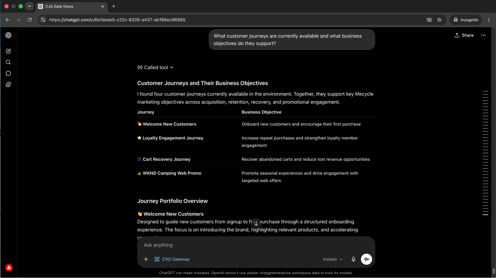

# 顧客に影響を与える前に、ジャーニーの問題を把握したい
<!-- last-modified: 2026-06-08 -->


ジャーニーの問題が検出されなければ、誰にも気づかれないうちに顧客にリーチできます。 このチュートリアルでは、CX Enterprise MCPを使用して、Adobe Journey Optimizerを開かずに平易な言葉で回答を得ることで、アクティブなAJOのジャーニーを確認し、キャンペーン設定を確認し、AI クライアントを通じて運用上の問題を明らかにし、その一歩先を行く方法を説明します。

| シナリオの詳細 | |
| --- | --- |
| CX エンタープライズアプリケーション | [Adobe Journey Optimizer （AJO） &#x200B;](https://experienceleague.adobe.com/ja/docs/journey-optimizer/using/ajo-home) |
| エージェント型ツール | [CX エンタープライズ MCP](../tools/mcp-servers.md#cx-enterprise-mcp-servers) |
| オーディエンス | キャンペーンマネージャー，マーケター |
| 前提条件 | MCP対応AI クライアント、AJOアクセス |

各ステップは、代表的なプロンプトとAI応答の例を示しています。 同じセッションで追加の探索を行うために、**さらに達成できる**&#x200B;のセクションを次に示します。


## 始める前に

>[!BEGINTABS]

>[!TAB  クロード.ai]

CX Enterprise MCPをカスタムコネクタとして接続して、Adobe Journey Optimizer ツールにアクセスします。

1. Claude.aiの&#x200B;**設定/統合**&#x200B;に移動します。
2. **カスタムコネクタを追加**&#x200B;を選択し、サーバーURLを入力します：`https://cx-enterprise.adobe.io/mcp`
3. **Connect**&#x200B;を選択し、Adobe IDでログインします。

完全なセットアップ：[Claude.ai カスタムコネクタのドキュメント &#x200B;](https://support.claude.com/en/articles/11175166-get-started-with-custom-connectors-using-remote-mcp)

>[!TAB ChatGPT]

ChatGPT デベロッパーモードを使用してCX エンタープライズ MCPを接続します（Pro、Plus、Business、Enterprise、またはEducation プランが必要）。

1. **ChatGPT設定**&#x200B;で&#x200B;**開発者モード**&#x200B;を有効にします。
2. **設定/統合**&#x200B;に移動し、**カスタムコネクタを追加/リモート MCP サーバー**&#x200B;を選択します。
3. サーバーURLを入力してください：`https://cx-enterprise.adobe.io/mcp`
4. **Connect**&#x200B;を選択し、Adobe IDでログインします。

完全なセットアップ：[ChatGPT MCP ドキュメント &#x200B;](https://developers.openai.com/api/docs/guides/tools-connectors-mcp)

>[!TAB その他のAI クライアント ]

Gemini、Microsoft Copilot、Cursor、Claude CodeなどのMCP互換アプリケーションを使用している場合、 次のエンドポイントを使用してCX Enterprise MCPに接続します。

```
https://cx-enterprise.adobe.io/mcp
```

サポートされているすべてのクライアントの完全なセットアップ手順：[AI クライアントに接続](../tools/mcp-servers.md)

>[!ENDTABS]

>[!NOTE]
>
>プロンプトが表示されたらAdobe IDでログインし、AJO環境にリンクされているIMS組織を選択します。 間違った組織を選択することは、認証エラーの最も一般的な原因です。
>
>最初の接続時に、AI クライアントからIMS組織の選択またはサンドボックスの指定を求められる場合があります。 そのコンテキストが設定されると、MCP サーバーは残りのセッションにコンテキストを使用します。
>
>一部のツールは、実行前に承認を求めます。 リクエストを確認して承認または辞退します。 確認なしにアクションは実行されません。


## ステップ 1：アクティブなジャーニーとその目的を確認する

まず、アクティブなジャーニーのインベントリとその背後にあるビジネス目標を尋ねることから始めます。 これにより、特定のジャーニーに入る前に、全体像を把握できます。

```
What customer journeys are currently available and what business objectives do they support?
```

+++回答の例を見る



+++


## ステップ 2：ジャーニーのステップと顧客体験を見直す

ジャーニーリストを表示して、AI クライアントに特定のジャーニーのステップを説明してもらい、各ステージで顧客体験について説明してもらいます。

```
Walk me through the [journey name] journey and explain the customer experience.
```

+++回答の例を見る


+++


>[!NOTE]
>
>手順1の結果から`[journey name]`をジャーニーの名前に置き換えます。


## ステップ 3：キャンペーン、オーディエンス、目的の見直し

ジャーニーからキャンペーンへの移行： どの施策が効果的で、誰をターゲットとし、どのような成果を生み出すのかを概要で確認しましょう。

```
Show me our campaigns, the audiences they target, and the outcomes they're designed to drive.
```

+++回答の例を見る


+++


## ステップ 4：キャンペーンとジャーニーがどのように連携しているかを把握する

AI クライアントに、キャンペーンとジャーニーの間の点と点を結びつけ、共通のエンゲージメント目標に向けてどのように連携するかを説明してもらいます。

```
How do our campaigns and journeys work together to improve customer engagement?
```

+++回答の例を見る


+++


## ステップ 5：優先順位の高いレコメンデーションを入手する

ライフサイクルマーケティングマネージャーの視点から構築された、次に注力すべき施策に関する、優先順位に関する推奨事項を尋ねましょう。 これにより、セッションでレビューしたあらゆる情報から、最も効果的なギャップと機会を明らかにできます。

```
If you were our lifecycle marketing manager, what would you prioritize next and why?
```

+++回答の例を見る


+++


>[!NOTE]
>
>AJO MCP Serverは、ジャーニーとキャンペーンの情報を表示しますが、ジャーニー、キャンペーン、コンテンツを変更することはできません。 レコメンデーションを実装するには、AJO アプリケーションに直接移動するか、AEM Content MCP Serverに接続して、同じセッション内のコンテンツの変更を行います。


## 達成したこと

AI クライアントとAdobe Journey Optimizerを接続し、5つのプロンプトを通じてジャーニーとキャンペーンのポートフォリオの全体像を構築しました。 アクティブなジャーニーとビジネス目標を調査し、特定のジャーニーのステップバイステップの顧客体験を確認して、アクティブなキャンペーンをオーディエンスと意図される成果にマッピングし、キャンペーンとジャーニーがどのように連携しているかを把握して、次に注力すべき施策についての推奨事項を優先的に提示しました。 これにより、AJOのインターフェイスを開くことなく、ライフサイクルマーケティング担当者やキャンペーンマネージャーは、戦略的な可視性を確保できます。


## より多くのことを達成

CX Enterprise MCPでは、AJOの幅広いジャーニーとキャンペーンの詳細を確認できます。 以下のシナリオを展開すると、同じセッションで試すことができるプロンプトが表示されます。

+++変更する前に公開されている情報を把握

他に何が実行されているかを知らずにジャーニーを変更するのはリスクがあります。 これらのプロンプトでは、何がアクティブで、何が最近変更されたか、キャンペーンがどのように設定されているかなどを確認できます。

**プロンプト**

```
Show me all journeys modified in the last 7 days.
```

```
Show me all journeys that use SMS as a channel.
```

```
Which campaigns are scheduled to end this week?
```

```
What loyalty challenges are currently active?
```

+++

+++特定のジャーニーの詳細

ジャーニーのレビュー、承認、引き継ぎが必要な場合、AJOを開かずに包括的なロジックを確認できるため、時間を節約できます。 これらのプロンプトは、条件、スケジュール、セグメントのルールをオンデマンドで表示します。

**プロンプト**

```
What is the entry condition for the [journey name] journey?
```

```
What are the exit conditions and timeout rules for the [journey name] journey?
```

```
What messages and wait conditions are in the [journey name] journey?
```

```
Which segment does the [journey name] journey target?
```

+++

+++特定のキャンペーンの詳細

承認、引き渡し、変更を行う前にキャンペーンの全設定を確認する必要がある場合、これらのプロンプトは、AJOを開かずに、オーディエンスルール、チャネル設定、スケジュールの詳細を表示します。

**プロンプト**

```
Walk me through the full configuration of the [campaign name] campaign.
```

```
What audience does the [campaign name] campaign target and how large is that segment?
```

```
What frequency cap and send schedule apply to the [campaign name] campaign?
```

```
Are any campaigns targeting overlapping audiences?
```

```
What channel configurations are set up in our AJO environment?
```

+++


## 詳細情報

| リソース | 見つかる内容 |
| --- | --- |
| [AI レジストリのAJO MCP Server](https://developer.adobe.com/ai-registry/#/mcp/ajo-mcp-server){target="_blank"} | AJO MCP Serverのツールと機能 |
| [AJO ドキュメント &#x200B;](https://experienceleague.adobe.com/ja/docs/journey-optimizer/using/ajo-home){target="_blank"} | Adobe AJOのドキュメント |
