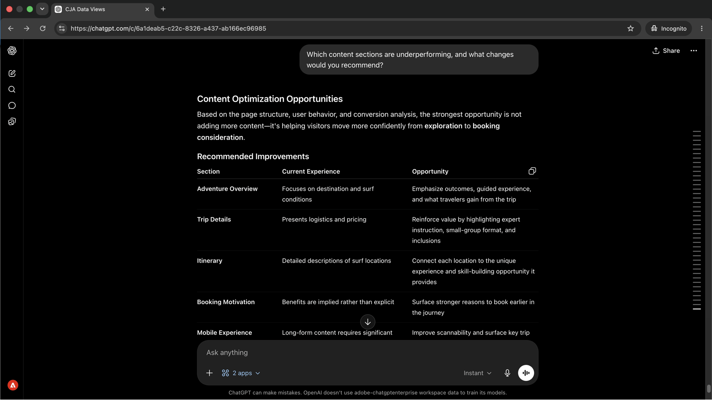

# パフォーマンスデータに基づくコンテンツの最適化
<!-- last-modified: 2026-06-08 -->


施策のパフォーマンスデータとコンテンツの更新を連携させるには、通常、分析ツールとCMSを切り替える必要があります。 このチュートリアルでは、Customer Journey AnalyticsとAEMを同じAI セッションで連携する方法を示します。コンバージョンギャップを伴うキャンペーンを浮き彫りにし、何が原因かを診断し、コンテンツを調査し、ターゲットを絞ったレコメンデーションを取得し、変更を適用します。

| シナリオの詳細 | |
| --- | --- |
| CX エンタープライズアプリケーション | [Customer Journey Analytics](https://experienceleague.adobe.com/ja/docs/analytics-platform/using/cja-overview/cja-overview)、[Adobe Experience Manager as a Cloud Service](https://experienceleague.adobe.com/ja/docs/experience-manager-cloud-service/content/overview/introduction) |
| エージェント型ツール | [CX Enterprise MCP](../tools/mcp-servers.md#cx-enterprise-mcp-servers)、[AEM Content MCP Server](https://experienceleague.adobe.com/ja/docs/experience-manager-cloud-service/content/ai-in-aem/using-mcp-with-aem-as-a-cloud-service) |
| オーディエンス | キャンペーンマネージャー，コンテンツストラテジスト，マーケティングオペレーション |
| 前提条件 | MCP対応AI クライアント、CJAアクセス、AEM as a Cloud Serviceアクセス |

各ステップは、代表的なプロンプトとAI応答の例を示しています。 同じセッションで追加の探索を行うために、**さらに達成できる**&#x200B;のセクションを次に示します。


## 始める前に

>[!BEGINTABS]

>[!TAB  クロード.ai]

両方のMCP サーバーをカスタムコネクタとして接続します。 それぞれを別々に追加します。

1. Claude.aiの&#x200B;**設定/統合**&#x200B;に移動します。
2. **カスタムコネクタを追加**&#x200B;を選択し、サーバーURLを入力して、**接続**&#x200B;を選択します。
3. Adobe IDでログインし、2台目のサーバーに対してこれを繰り返します。

| サーバー | エンドポイント |
| --- | --- |
| CX Enterprise MCP | `https://cx-enterprise.adobe.io/mcp` |
| AEM Content MCP Server | `https://mcp.adobeaemcloud.com/adobe/mcp/content` |

完全なセットアップ：[Claude.ai カスタムコネクタのドキュメント &#x200B;](https://support.claude.com/en/articles/11175166-get-started-with-custom-connectors-using-remote-mcp)

>[!TAB ChatGPT]

ChatGPT デベロッパーモードを使用して両方のMCP サーバーを接続します（Pro、Plus、Business、Enterprise、またはEducation プランが必要）。 各サーバーを個別に追加します。

1. **ChatGPT設定**&#x200B;で&#x200B;**開発者モード**&#x200B;を有効にします。
2. **設定/統合**&#x200B;に移動し、**カスタムコネクタを追加/リモート MCP サーバー**&#x200B;を選択します。
3. サーバーURLを入力し、**Connect**&#x200B;を選択して、Adobe IDでログインします。
4. 2番目のサーバーに対してこれを繰り返します。

| サーバー | エンドポイント |
| --- | --- |
| CX Enterprise MCP | `https://cx-enterprise.adobe.io/mcp` |
| AEM Content MCP Server | `https://mcp.adobeaemcloud.com/adobe/mcp/content` |

完全なセットアップ：[ChatGPT MCP ドキュメント &#x200B;](https://developers.openai.com/api/docs/guides/tools-connectors-mcp)

>[!TAB その他のAI クライアント ]

Gemini、Microsoft Copilot、Cursor、Claude CodeなどのMCP互換アプリケーションを使用している場合、 以下のエンドポイントを使用して、両方のMCP サーバーに接続します。

| サーバー | エンドポイント |
| --- | --- |
| CX Enterprise MCP | `https://cx-enterprise.adobe.io/mcp` |
| AEM Content MCP Server | `https://mcp.adobeaemcloud.com/adobe/mcp/content` |

サポートされているすべてのクライアントの完全なセットアップ手順：[AI クライアントに接続](../tools/mcp-servers.md)

>[!ENDTABS]

>[!NOTE]
>
>プロンプトが表示されたらAdobe IDでログインし、CJAおよびAEM環境にリンクされているIMS組織を選択します。 間違った組織を選択することは、認証エラーの最も一般的な原因です。
>
>最初の接続時に、AI クライアントからIMS組織の選択またはサンドボックスの指定を求められる場合があります。 そのコンテキストが設定されると、MCP サーバーは残りのセッションにコンテキストを使用します。
>
>一部のツールは、実行前に承認を求めます。 リクエストを確認して承認または辞退します。 確認なしにアクションは実行されません。


## ステップ 1：コンバージョンギャップのある施策の特定

Adobe CJAを利用して、クリックスルー率は高いものの、コンバージョン率が低いキャンペーンを特定できます。 このパターン（高いインテント、低完了）は、通常、ランディングページ上のコンテンツまたはエクスペリエンスの問題を示します。

```
Which campaigns have strong click-through but low conversion in the last 30 days?
```

+++回答の例を見る


+++


## 手順2：根本原因の診断

何がギャップを生んでいるのかを把握します。 ドロップオフが特定のデバイスタイプ、オーディエンスセグメント、コンテンツインタラクションのいずれに集中しているかを確認します。

```
What's causing the conversion drop-off, is it device, segment, or content?
```

+++回答の例を見る


+++


## 手順3:AEMのコンテンツを確認する

パフォーマンスの低いキャンペーンを特定したら、AEMからランディングページを同じセッションに移動します。 現在のページの内容を確認することは、何を変更すべきかを理解するための出発点となります。

```
Show me the Bali Surf Camp page.
```

+++回答の例を見る

AEMからのランディングページの現在のコンテンツを表示する

+++


## ステップ 4：的を絞ったレコメンデーションの提供

AI クライアントに、データが示したものとページ上のものを結びつけるように依頼します。 両方のソースでAIを利用する理由により、どのコンテンツセクションが脱落の原因になり、何を変更すべきかを特定できます。

```
Which content sections are underperforming, and what changes would you recommend?
```

+++回答の例を見る

パフォーマンスの低いコンテンツセクションを特定し、特定の変更を推奨する

+++


## 手順5：変更を適用して確認する

AI クライアントに、レコメンデーションに基づいて最適化されたページのバージョンを作成してもらい、何が変更され、なぜ変更されたかを要約します。

```
Create an optimized version of the Bali Surf Camp page and summarize the proposed changes.
```

+++回答の例を見る


+++


>[!CAUTION]
>
>確認する前に、提案された変更の完全な概要を確認してください。 AEM Content MCP Serverは、AEM環境に変更内容を書き込みます。 ページは、明示的に再公開されるまで、公開状態のままになります。


## 達成したこと

Customer Journey AnalyticsとAEMを単一のAI セッションで連携し、キャンペーンデータからコンテンツ変更のデプロイにツールを切り替えることなく移行しました。 コンバージョンのギャップがあるキャンペーンを特定し、根本原因を診断して、ランディングページを調査し、データとコンテンツの両方に基づいたターゲットを絞ったレコメンデーションを得て、変更内容を同じ会話に適用しました。 これにより、Adobe Analytics insightと公開されたコンテンツ間のフィードバックループが短縮され、同じセッションでパフォーマンスの低い任意の数のページに拡張できます。


## より多くのことを達成

CJAとAEMを同じセッションで連携させることで、課題の特定から出荷時の修正まで、サイクル全体をカバーすることができます。 以下のシナリオを展開して、試せるプロンプトを表示します。

+++パフォーマンスを妨げているコンテンツの特定

エンゲージメントが低いトラフィックは、トラフィックの問題ではなく、コンテンツの問題を示します。 これらのプロンプトを活用すれば、キャンペーンが期限を迎える前に注意が必要な特定のページやパターンを特定できます。

**プロンプト**

```
Which campaigns have the highest traffic but lowest conversion rate this quarter?
```

```
Which pages have a high bounce rate but also high traffic?
```

```
Compare engagement rates for landing pages across email and paid social campaigns.
```

```
Find AEM pages linked from active campaigns that haven't been updated in over 60 days.
```

+++

+++データの内容を修正する

パフォーマンスが低い施策を把握したら、パフォーマンスデータにもとづいて、的を絞った変更をおこないます。 これらのプロンプトを使用すると、診断に基づいて特定のセクションを更新できます。

**プロンプト**

```
Update the CTA on the [page name] page to better match the campaign audience.
```

```
Rewrite the hero headline on the [page name] page to address the mobile drop-off.
```

```
Add a trust signal to the [page name] page above the conversion form.
```

```
Which pages updated in this session still need to be published?
```

+++

+++次のキャンペーンの前に改善を出荷する

セッション中に加えた変更は、すぐに積み重なることができます。 これらのプロンプトは準備状況の確認、レビュー用の更新のグループ化、キャンペーンが公開される前のクリーンなプロモーションに役立ちます。

**プロンプト**

```
Show me all pages updated in this session that are still unpublished.
```

```
Create a launch with all changes from this session for review before publishing.
```

```
Give me a summary of all changes made in this session.
```

```
Publish all confirmed changes and share the updated URLs.
```

+++


## 詳細情報

| リソース | 見つかる内容 |
| --- | --- |
| [CJA MCP Server ドキュメント &#x200B;](https://developer.adobe.com/analytics-mcp/docs/cja/) | CJA MCPの設定とツールリファレンス |
| [AEM Content MCP Server ドキュメント &#x200B;](https://experienceleague.adobe.com/ja/docs/experience-manager-cloud-service/content/ai-in-aem/using-mcp-with-aem-as-a-cloud-service) | AEM Content MCPの設定と使用ガイド |
| [AI レジストリのCJA MCP Server](https://developer.adobe.com/ai-registry/#/mcp/cja-mcp) | CJA MCP Serverのツールと機能 |
| [AI レジストリのAEM Content MCP Server](https://developer.adobe.com/ai-registry/#/mcp/aem-content-mcp) | AEM Content MCP Serverのツールと可用性 |
| [MCP サーバー](../tools/mcp-servers.md) | AI クライアントをAdobe MCP サーバーに接続する |
