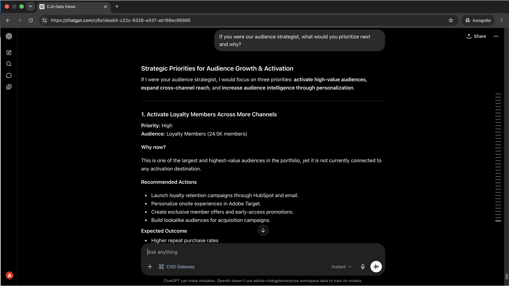

# オーディエンスとアクティベートされた場所を把握

<!-- last-modified: 2026-06-04 -->


どのオーディエンスがアクティベートされ、どこを流れているのか、配信先が健全かどうかを把握することは、通常、Real-Time CDPを開き、複数のスクリーンを操作することを意味します。 このチュートリアルでは、RTCDP MCP Serverを使用して、宛先設定、アクティベーションステータス、データフローの正常性を確認しながら、AI クライアントを通じて同じ回答を得る方法を説明します。

| シナリオの詳細 | |
| --- | --- |
| **CX エンタープライズ アプリケーション** | [Real-Time Customer Data Platform （Real-Time CDP） ](https://experienceleague.adobe.com/ja/docs/experience-platform/rtcdp/home) |
| **エージェント ツール** | [CX エンタープライズ MCP](../tools/mcp-servers.md#cx-enterprise-mcp-servers) |
| **オーディエンス** | マーケター、アナリスト、オペレーター |
| **前提条件** | MCP対応AI クライアント、Real-Time CDPアクセス |

各ステップは、代表的なプロンプトとAI応答の例を示しています。 同じセッションで追加の探索を行うために、**さらに達成できる**&#x200B;のセクションを次に示します。

## 始める前に

>[!BEGINTABS]

>[!TAB  クロード.ai]

CX Enterprise MCPをカスタムコネクタとして接続して、Real-Time CDP ツールにアクセスします。

1. Claude.aiの&#x200B;**設定/統合**&#x200B;に移動します。
2. **カスタムコネクタを追加**&#x200B;を選択し、サーバーURLを入力します：`https://cx-enterprise.adobe.io/mcp`
3. **Connect**&#x200B;を選択し、Adobe IDでログインします。

完全なセットアップ：[Claude.ai カスタムコネクタのドキュメント ](https://support.claude.com/en/articles/11175166-get-started-with-custom-connectors-using-remote-mcp)

>[!TAB ChatGPT]

ChatGPT デベロッパーモードを使用してCX エンタープライズ MCPを接続します（Pro、Plus、Business、Enterprise、またはEducation プランが必要）。

1. **ChatGPT設定**&#x200B;で&#x200B;**開発者モード**&#x200B;を有効にします。
2. **設定/統合**&#x200B;に移動し、**カスタムコネクタを追加/リモート MCP サーバー**&#x200B;を選択します。
3. サーバーURLを入力してください：`https://cx-enterprise.adobe.io/mcp`
4. **Connect**&#x200B;を選択し、Adobe IDでログインします。

完全なセットアップ：[ChatGPT MCP ドキュメント ](https://developers.openai.com/api/docs/guides/tools-connectors-mcp)

>[!TAB その他のAI クライアント ]

Gemini、Microsoft Copilot、Cursor、Claude CodeなどのMCP互換アプリケーションを使用している場合、 次のエンドポイントを使用してCX Enterprise MCPに接続します。

```
https://cx-enterprise.adobe.io/mcp
```

サポートされているすべてのクライアントの完全なセットアップ手順：[AI クライアントに接続](../tools/mcp-servers.md)

>[!ENDTABS]

>[!NOTE]
>
>プロンプトが表示されたらAdobe IDでログインし、Real-Time CDP インスタンスにリンクされているIMS組織を選択します。 間違った組織を選択することは、認証エラーの最も一般的な原因です。

## ステップ 1：オーディエンスとは何かを発見する

まず、利用可能なオーディエンスのインベントリと、獲得した顧客行動について尋ねます。 これにより、特定のセグメントをドリルダウンする前に、全体像を把握できます。

```
What audiences are currently available and what customer behaviors do they represent?
```

+++回答の例を見る


+++


## ステップ 2：最も価値のあるセグメントの特定

オーディエンスの状況を把握したら、どのセグメントが最も大きく、何が戦略的に価値があるのかを確認します。

```
Which audiences are the largest and what makes them valuable?
```

+++回答の例を見る


+++


## 手順3：アクティベーションと宛先の確認

オーディエンスが現在どこへ流れているのか、どの配信先にアクティブ化されているのかを確認します。

```
Where are our audiences currently being activated and to which destinations?
```

+++回答の例を見る

オーディエンスのアクティブ化ステータスと宛先マッピングを表示する

+++


## ステップ 4：戦略的な推奨事項を提案する

CX Enterprise MCPのRTCDP ツールは読み取り専用で、アクティベーションステータス、宛先のヘルス、データフローのデータを表示しますが、設定は変更しません。 問題を特定すると、アプリケーションで修正が行われます。

```
If you were our audience strategist, what would you prioritize next and why?
```

+++回答の例を見る



+++


>[!NOTE]
>
>CX Enterprise MCPのRTCDP ツールは、宛先とアクティベーション データを表示しますが、宛先設定、セグメント定義、データフロー設定を変更することはできません。 修正ステップは、Real-Time CDP アプリケーションで実行されます。

## 達成したこと

AI クライアントとReal-Time CDPを接続し、4つのプロンプトでオーディエンスポートフォリオの戦略的像を構築しました。 利用可能なオーディエンスを、獲得した顧客行動にマッピングし、最大で最も価値のあるセグメントを特定し、各オーディエンスがどこへ向かっているのか、どの宛先に向かっているのかを確認し、次のアクティベーションに関する優先順位のレコメンデーションを受け取りました。 これにより、複数のReal-Time CDP画面を移動する代わりに、直接的かつ戦略的なやり取りが可能になります。

## より多くのことを達成

CX Enterprise MCPのReal-Time CDPツールは、幅広いオーディエンスとアクティベーションクエリをサポートしています。 以下のシナリオを展開すると、同じセッションで試すことができるプロンプトが表示されます。

+++キャンペーンの送信前に何が発生しているのかを正確に把握

アクティベーションの失敗はサイレントです。 オーディエンスは警告しなくても流れるのを止め、キャンペーンは古いリストに送信されます。 これらのプロンプトを使用すれば、どのセグメントがいつどの宛先にリーチしているのかを明確に把握できます。

**プロンプト**

```
Which audiences are activated to Google Ads?
```

```
Show me the activation history for the [audience name] audience.
```

```
What is the last refresh time for the [audience name] audience?
```

+++

+++アクティベーションの問題がキャンペーンに影響を与える前に発見

実行を見逃した宛先や、アクティブな宛先がないセグメントは、キャンペーンが意図したよりも少ない人にリーチしている可能性があることを意味します。 これらのプロンプトは、そうしたギャップを先見的に表面化します。

**プロンプト**

```
Are there any audiences with no active destinations?
```

```
Are any destination dataflows showing errors right now?
```

```
Which audiences have not been updated in the last 30 days?
```

+++

+++オーディエンスの状況を監査および把握

オーディエンスの規模が変化したり、新しいセグメントが創出されたりした場合、明確なインベントリを作成することで、間違ったリストを利用せずに計画を立てることができます。 これらのプロンプトにより、必要に応じて可視性を調整できます。

**プロンプト**

```
How many profiles are in the [segment name] segment?
```

```
Show me all audiences created in the last 30 days.
```

```
Which audience has grown the most in the last 60 days?
```

```
How many total profiles are in my Real-Time CDP instance?
```

+++

+++IDとデータ品質の理解

ID名前空間と結合ポリシーは、オーディエンスに含まれるプロファイルとその解決方法に直接影響します。 これらのプロンプトには、予期しないオーディエンスのサイズやプロファイルの重複を説明できる設定の詳細が表示されます。

**プロンプト**

```
What identity namespaces are configured and which are most commonly used?
```

```
What merge policies are defined and which audiences use each one?
```

```
Are there any audiences using a non-default merge policy that could cause profile overlap?
```

+++


## 詳細情報

| リソース | 見つかる内容 |
| --- | --- |
| [Real-Time CDP MCP ドキュメント ](https://experienceleague.adobe.com/en/docs/experience-cloud-ai/experience-cloud-ai/mcp/rtcdp-mcp) | MCP サーバーの設定とツール リファレンス |
| [Adobe AI レジストリ ](https://developer.adobe.com/ai-registry/?type=mcp) | MCP サーバーのメタデータと可用性 |
| [Real-Time CDP ドキュメント ](https://experienceleague.adobe.com/ja/docs/experience-platform/rtcdp/home) | Adobe Real-Time CDPのドキュメント |
| [AEP宛先ドキュメント ](https://experienceleague.adobe.com/ja/docs/experience-platform/destinations/home) | 完全な宛先の参照 |
